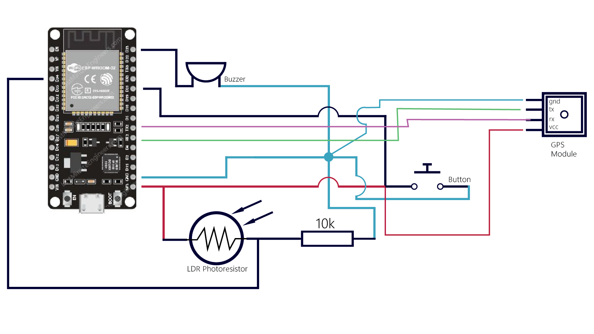
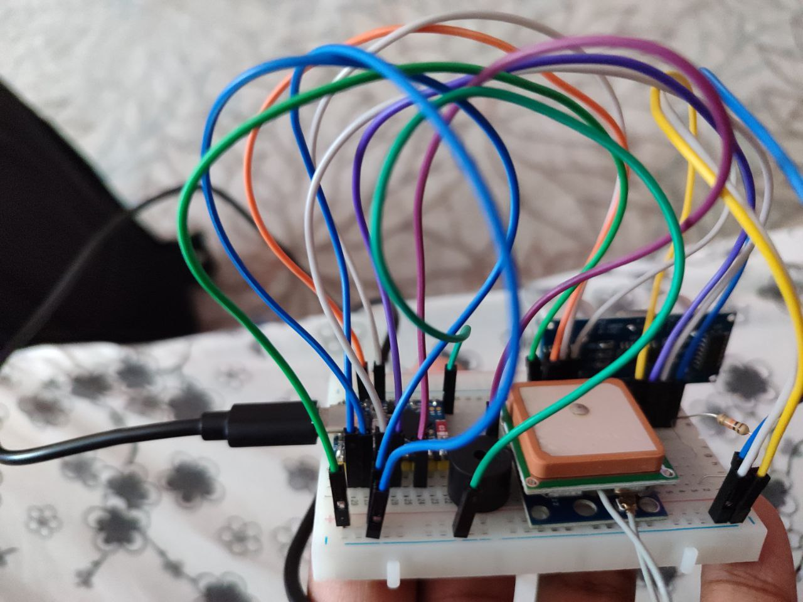
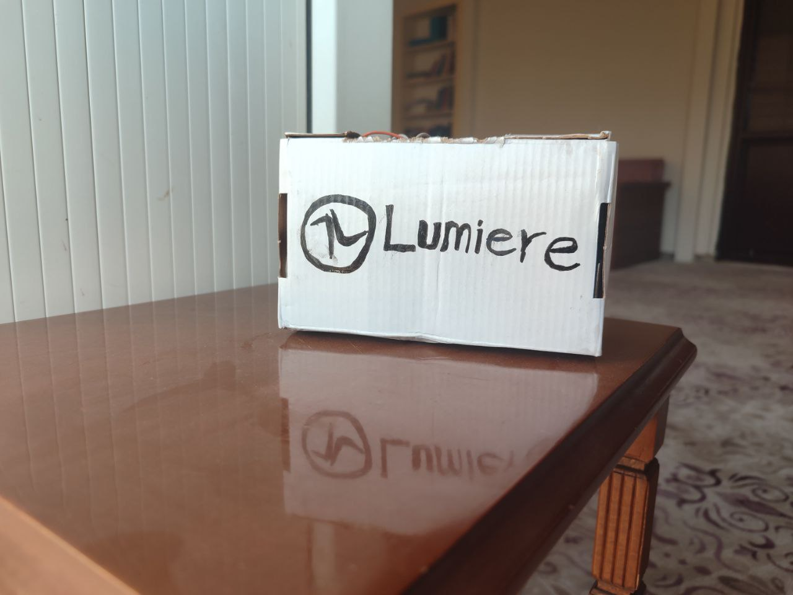
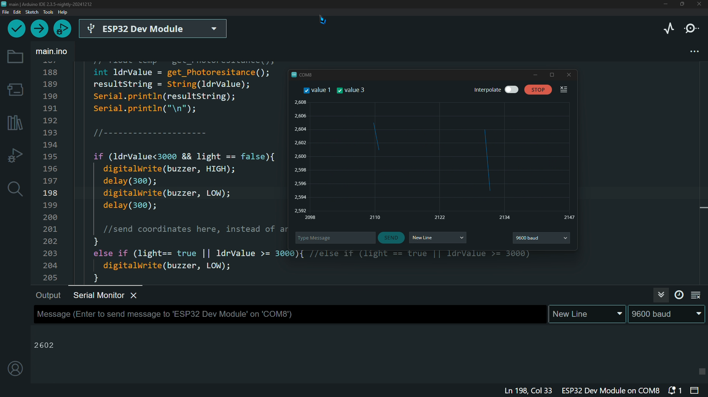

# Project-Lumiere

**project name**-------

Lumiere

**desc**-----

Smart Streetlight failure reporting system.

-**What my invention does: 252**

LUMIERE is a small electronic device, connected to the internet (IoT) and placed under a streetlamp, that notifies the local authorities about regions that need attention and immediate intervention.

----------------------

-**Where I got my inspiration: 628**

As I grew up, I've always noticed the issues we kept having when it comes to electricity. One of them being streetlights, always suffering damages, and no one coming to fix them. We would notice at night and forget to report during daytime. Due to other chores on our day-to-day life.

Taking the risk and all the negative effect this could have on our society, I decided to think of a way to automate the reporting to the local authorities. And that is when I came up with Project Lumiere.

----------------------------

-**How it works: 183**

The device measures the level of light it can get from the lamps during night time. Measurements are constantly done using a Light Dependent Resistor LDR.  And sends real-time information to the  admin panel. When abnormal situations come up, such as light failure, it sends urgent notification to local authorities such as municipalities. Indicating that immediate attention is needed in that specific region.

------------------

-**How you developed your design | Design Process: 1289**

I used esp32 microcontroller for all the computing power required for the project.

For darkness detection, I used a Light Dependent Resistor LDR. Also known as Photoresistor. Its internal resistor changes based on the light reflected to its upper surface. Making it ideal for the project.

For Geolocation, I used GY-NEO6MV2 GPS Module. It locks onto a minimum of 4 satellites before it can start returning reliable position data and has a 5-meter accuracy. The device will be placed somewhere close to the lamp itself. At first, we'll read the average amount of light it gets during daytime and nighttime. When it is between a certain interval--nighttime and light off--the buzzer goes off, current location is retrieved and sent to local authorities.

Depending on the severity of the situation--the intensity of the darkness in the area--the buzzer beeping interval increases or decreases. And with a press of a button by the admin, everything returns to normal.

The data transfer process happens through http protocol, sent to specific IP addresses. The ESP32 microcontroller gets access to the internet once it connects to a WiFi network.

--------------

-**What sets it apart: 763**

1-Low Cost: The fact that the prototype only consists of a small number of electronic components, relatively cheap and highly accessible, makes it worth trying to implement into real life  use cases.
2-Easy Maintenance: When it comes to maintenance and repair, it's really important not to adhere to complex systems in the first place. Lumiere fits that purpose right in. 
3-Save Time and Money: No need to hire routine maintenance professionals for something that has no fault at all.
4-Low Power Consumption: The esp32 only draws at around 5V/160~260mA/ ~78.32 mW on active mode, and ~26.85 μW during deep-sleep mode.

----------------

-**What the future holds for it 638**

In a world like ours, light is indispensable in our day-to-day life. Projects like this play a huge role in street lighting. By reporting faulty lamps, it helps to prevent possible accidents and enhance safety for both pedestrians and drivers. With a project like this, I believe that other problems generated from uncontrolled public street lighting  systems could be minimized.

And in the future, the project could be improved and fully automated. To a level which robots perform all the necessary tasks necessary to get ahead of local issues, regarding lifestyle. Such as, changing the lamp during daytime, without human intervention. 

---------------
image1----------

Main Logo

Image 2-------

Schematics. Made with adobe illustrator. After Proteus Circuit Design failed to launch

image 3----------

Initial Testing. Usage of jumper wires and breadboard.

image4------BOX

First Case prototype. Made out of Cartoon. Compact, Lightweight and easily portable.

image 5--------

Serial Data Retrieval and performance monitoring on Arduino IDE. It's part of the testing process.

